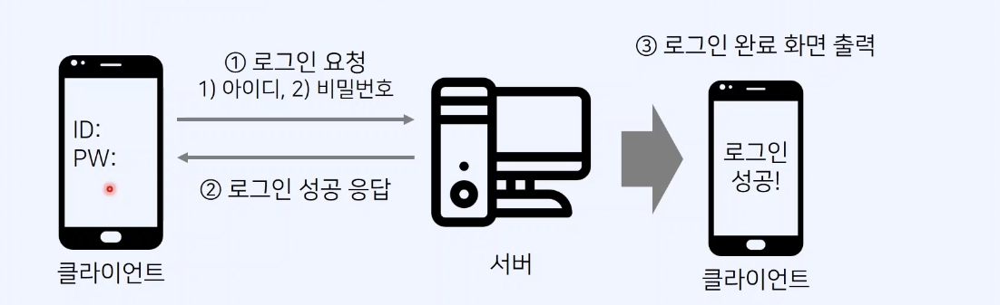
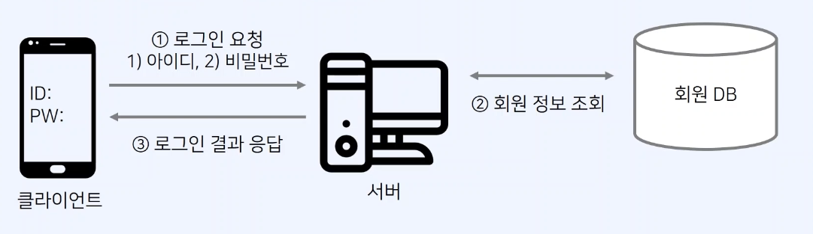
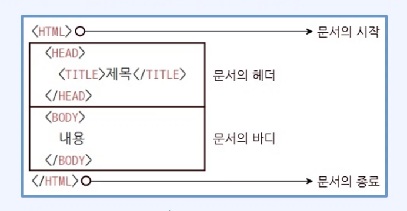
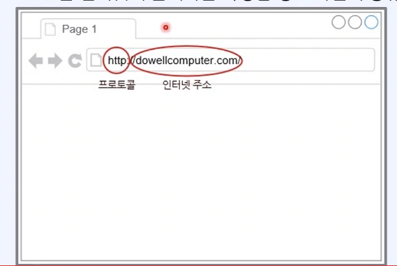
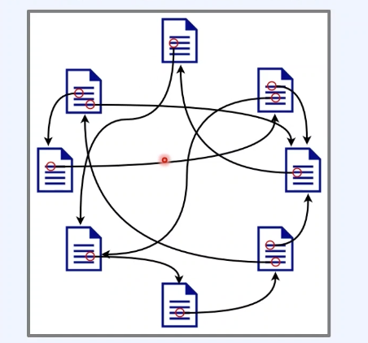
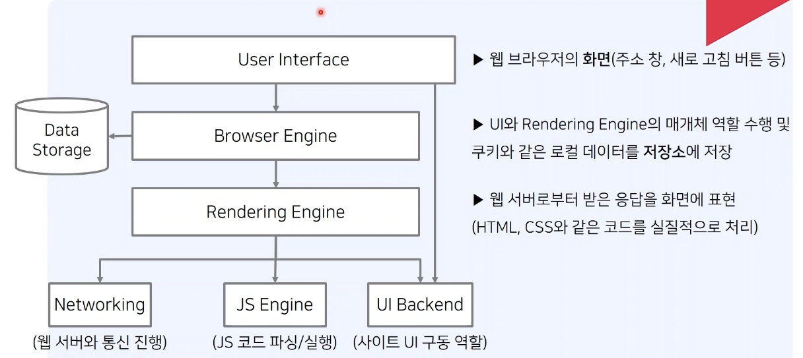

## 다양한 웹 브라우저

- 흔히 웹 사이트에 접속할 때는 웹 브라우저 프로그램을 사용
- 일반적으로 웹 브라우저는 다음과 같은 기능을 수행
  - 웹 페이지를 서버에 요청(request)하여 서버의 응답(response)을 웹 문서 형태로 받음
  - 받은 웹 문서(HTML, CSS 등)을 렌더링하여 모니터 화면에 웹 페이지를 표시

## 서버와 클라이언트

- 클라이언트가 요청(request)을 보내면 서버(response)가 응답한다.
- 서버와 클라이언트 구조를 따르는 대표적인 예시로는 웹 서비스가 있음

### 클라이언트

- 클라이언트는 일종의 고객(client)으로 이해 가능
- 서버로 요청(request)을 보낸 뒤에, 응답(response)이 도착할때까지 기다림
- 서버로부터 응답을 받으면, **서버의 응답을 처리하여 화면에 출력**

### 서버

- 서버는 클라이언트로부터 받은 요청을 처리해 응답(response)을 전송
- 대표적인 서버로는 웹 서버(server)가 있음

## HTML(Hypertext Markup Language)

- 서버가 클라이언트에게 보내주는 문서의 대표적인 문서인 HTML
- HTML은 웹 문서를 작성하기 위해 사용하는 프로그래밍 언어
- 여기서 마크업(markup)은 웹 문서가 모니터 화면에서 보이는 형태를 결정하는 구조를 말함
- HTML 문서는 `<HTML>` 태그로 시작하고 `</HTML>` 태그로 종료된다.

## HTTP(Hypertext Transfer Protocol)

- 하이퍼텍스트를 전송하기 위해 개발된 프로토콜로 간편히 데이터를 전송하게 해줌
- 웹 브라우저의 주소 표시줄에 URL(Uniform Resource Locator)을 입력한 뒤에 접속을 시도한다.
- URL은 인터넷에 존재하는 특정한 정보 자원의 종류와 위치를 나타내는 문자열

## 웹(Web)

- **HTTP 프로토콜**을 이용해 수없이 많은 페이지로 링크를 타고 이동할 수 있음
- 웹에서는 많은 페이지가 마치 거지물과 같은 연결 형태를 가짐

  

## 웹 브라우저의 구조

- 웹 브라우저를 도식화하면 위와 같음
- User Interface:

## 웹 브라우저의 동작 방식

- 웹 클라이언트는 웹 브라우저를 이용
- 웹 브라우저에 주소를 입력하면 GET 방식으로 서버에 웹 문서 요청
- 웹 서버는 적절한 웹 문서를 찾아서 응답
- 이후에 웹 브라우저는 문서를 화면에 표시
