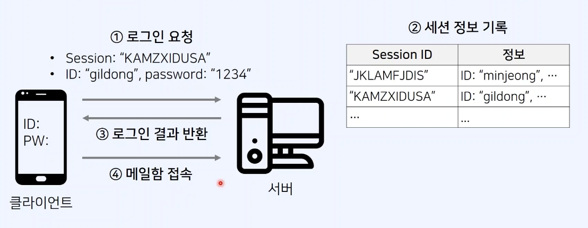
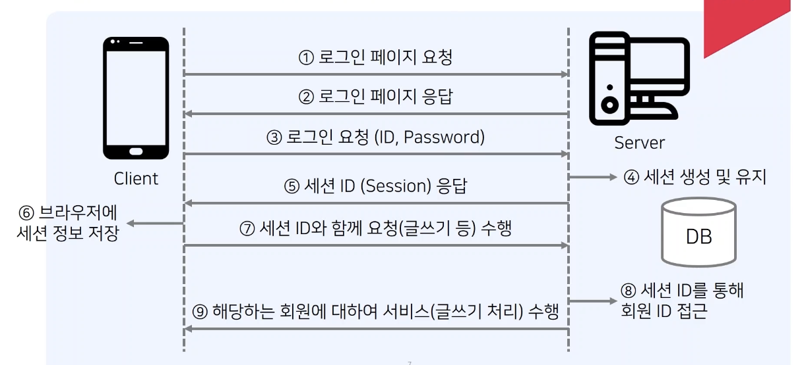

## 쿠키(Cookie)와 세션(Session)

### 쿠키

- 쿠키: 사용자가 특정한 웹사이트에 방문할 때, **사용자 컴퓨터에 저장되는 기록 파일**
- HTTP 쿠키(웹 쿠키, 브라우저 쿠키)는 서버가 사용자의 웹 브라우저에 전송하는 작은 데이터 조각, 브라우저는 그 데이터 조각들을 저장해 놓았다가, 동일한 서버에 재 요청 시 저장된 데이터를 함께 전송, 쿠키는 두 요청이 동일한 브라우저에서 들어왔는지 아닌지를 판단할 때 주로 사용
- 서버의 자원을 전혀 사용하지 않음
  - 서버 자원을 전혀 사용하지 않는다는 표현은 “저장 위치” 기준으로는 맞지만, 쿠키는 클라이언트-서버 간 요청마다 자동으로 전송되므로 트래픽 부담은 존재
- 보안 강도가 낮기 때문에 민감 정보를 담지 않는 것이 원칙
  - 쿠키의 짧은 라이프타임 설정 및 Secure, HttpOnly, SameSite 쿠키 설정을 하면 보안 강도 높일 수 있음
- 사용 예시: "아이디와 비밀번호를 저장하시겠습니까?"
- https://developer.mozilla.org/ko/docs/Web/HTTP/Guides/Cookies

### 세션

- 세션: 한 명의 사용자(브라우저)의 상태를 유지하는 기술
- 서버가 클라이언트에게 고유한 Session ID를 부여하면, 클라이언트는 접속할 때 마다 Session ID와 함께 요청
- 사용 예시: 웹 사이트에 한번 로그인 하면, 다른 페이지로 이동해도 계속 접속 상태가 유지
- 만약 Session ID를 다른 클라이언트에게 탈취당하면, 다른 사람이 자신의 행세를 할 수 있음
- 세션은 서버 메모리 또는 서버가 연결된 세션 저장소(Redis 등)에 유지되는 사용자 상태 정보
- 클라이언트에는 세션 ID만 쿠키 형태로 저장 가능하며, 실제 사용자 정보는 서버에 저장
- 세션 ID 탈취 위험이 있으므로 쿠키에 저장 시 HttpOnly, Secure, SameSite 설정을 반드시 고려
- https://owasp.org/www-project-cheat-sheets/cheatsheets/Session_Management_Cheat_Sheet.html

### 세션 개요

- 서버에서 가지고 있는 객체로, 특정 사용자의 로그인 정보를 유지하기 위해 사용할 수 있음
- 예를 들어 우리가 웹 사이트에 로그인한 뒤에, 서버에서는 **세션 ID에 따른 회원 ID 정보를 기록**함
- 클라이언트는 해당 세션을 계속 유지함, 예를 들어 메일함에 접속할 때도 세션 ID를 서버에 전송함
- 다시 말해 세션은 자신이 누구인지를 서버에 알려주는 역할을 수행함

## 세션 인증 방식 예시 플로우 차트

## 세션 방식의 특징

장점

- 클라이언트에게는 **세션 ID(회원 식별 목적)**을 제공하고, 회원에 대한 중요한 정보를 서버가 가지고 있다.
- 민감한 데이터를 클라이언트에 직접적으로 보내지 않는다.
- 클라이언트 브라우저가 가지고 있는 세션(Session) ID 자체에는 개인정보를 포함하고 있지 않다.
- 민감 정보가 서버에만 있고, 쿠키에는 Session ID만 있기 때문에 안전함

단점

- **악의적인 공격자가 세션 ID를 탈취**하여 사용자인 척 위장할 수 있다.
  - 세션 ID 탈취는 대표적 공격인 <strong>세션 하이재킹(Session Hijacking)</strong>으로 잘 알려져 있습니다.
- 웹 서버에 세션 정보를 기록하고 있어야 하므로, 접속자가 많을 때 **서버에 메모리 부하**가 존재할 수 있다.
  - 단순히 "메모리 부하"가 문제라기보다,
    서버 확장성(스케일링)이 떨어질 수 있는 구조가 더 큰 문제, 여러 서버를 운영할 경우, 각 서버가 같은 세션 정보를 공유해야 함 → 세션 공유 저장소가 필요

# 정리

- 쿠키와 세션은 **대체 관계가 아니라 서로를 보완하는 관계**
- 실제 웹 인증 구조에서는 쿠키 + 세션 조합으로 함께 사용
- 현대 웹에서는 세션 기반뿐 아니라 JWT 기반 인증에서도, 토큰을 HttpOnly 쿠키에 담아 세션 방식과 유사하게 동작시키는 패턴이 널리 사용됨

## 쿠키와 세션은 어떻게 함께 동작할까?

1. 세션은 서버에서 상태를 저장하는 기술

- 로그인 성공 시 서버가 메모리/DB/Redis 등에
  세션 저장소(Session Store) 를 생성하고
  그 안에 “회원 정보” 또는 “식별 정보”를 저장합니다.

2. 쿠키는 클라이언트가 세션 ID를 보관하는 저장소

- 서버는 클라이언트에게 세션 ID 를 전달하고
- 클라이언트는 이 값을 쿠키에 저장합니다.

3. 이후 요청마다 브라우저는 자동으로 쿠키에 담긴 sessionID를 전송

- 브라우저는 사용자가 어떤 페이지를 이동하든
  HTTP 요청에 쿠키를 자동 포함시킴

4. 서버는 쿠키의 세션 ID 값을 보고 사용자를 식별
