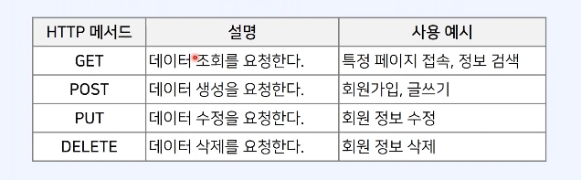
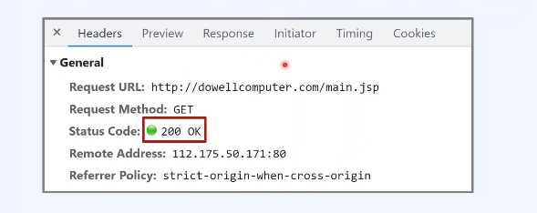
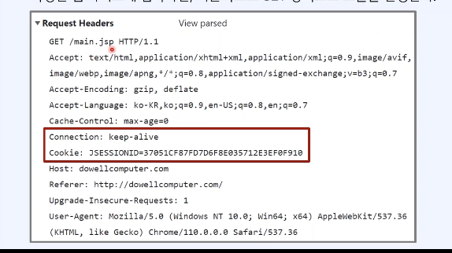
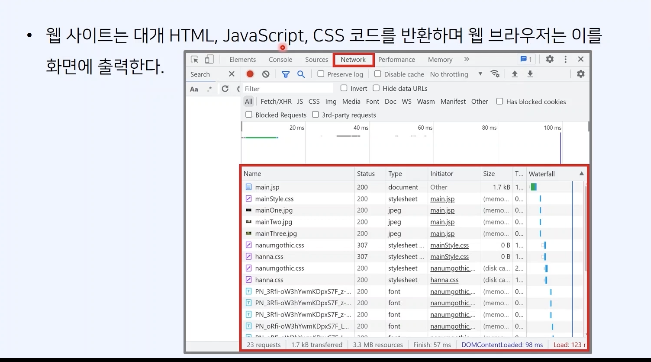

## HTTP

- HTTP(HyperText Transfer Protocol)는 **웹 상에서 데이터를 주고받기 위한 프로토콜**이다.

- 웹 문서뿐 아니라, 모바일 앱, RESTful API, 게임 등 다양한 클라이언트-서버 통신에 사용된다.

- HTTP는 **애플리케이션 계층 프로토콜**로, TCP/IP 위에서 동작한다.

## HTTP 메서드

- 클라이언트는 요청(request)의 목적에 따라 적절한 HTTP 메서드를 사용
- 대표적인 HTTP 메서드는 다음과 같음

  - GET → 데이터 조회

  - POST → 데이터 생성

  - PUT → 전체 데이터 수정

  - PATCH → 일부 데이터 수정

  - DELETE → 데이터 삭제

- 요청 결과는 <strong>HTTP 상태 코드(status code)</strong>로 확인 가능

- 예: 200 OK → 성공, 201 Created → 생성 성공, 204 No Content → 삭제 성공

## HTTP 메서드 사용 예시

- 웹사이트에 접속하면, 기본적으로 GET 방식으로 호출을 진행

- 상태 코드(status code)를 이용해 본인의 요청에 대한 결과를 응답 받을 수 있음

## HTTP 상태 관리와 세션

- HTTP는 <strong>상태를 저장하지 않는 프로토콜(Stateless)</strong>이다.

  - 클라이언트가 요청 후 응답을 받으면 연결을 종료
  - 서버는 각 요청을 독립적으로 처리하며, 기본 HTTP만으로는 사용자 상태를 유지할 수 없다.

- 하지만 웹 서비스에서 장바구니, 로그인 상태 등 **사용자별 상태 유지**가 필요하다.

  - 로그인 사용자: 세션 ID 또는 JWT 토큰으로 사용자를 식별
  - 비로그인 사용자: 임시 쿠키나 LocalStorage 등으로 임시 식별자 사용

- 실제 상태 유지 방식

  1. 사용자가 장바구니에 상품을 담으면, 상품 정보와 수량 등은 **서버 DB에 저장**

  2. 세션이나 JWT는 단순히 **“누구의 장바구니인지”를 구분**하는 식별자 역할

  3. 사용자가 페이지를 이동하거나 다시 접속하면, 서버는 식별자를 기준으로 DB에서 장바구니 상태를 조회하고 클라이언트에 전달

  4. 이렇게 하면 HTTP 자체는 Stateless이지만, **세션/토큰 + DB 조합**으로 상태 유지가 가능하다.

- 서버 입장에서 접속 유지에 대한 요구가 적어, 불특정 다수를 대상으로 하는 서비스에 적합

## Keep Alive 기능

- HTTP 1.0에서는 기본적으로 연결을 요청마다 닫음 → TCP 연결 설정/종료 비용 발생

- HTTP 1.1에서 Keep-Alive 기본 적용 → TCP 연결을 일정 시간 유지 → 여러 요청 처리

- 결과적으로 네트워크 효율과 응답 속도가 개선되며, 한 사이트에서 여러 CSS, JS, 이미지 파일을 빠르게 제공 가능
