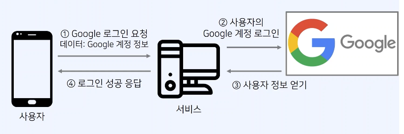
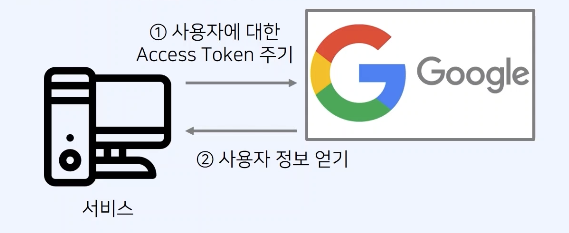
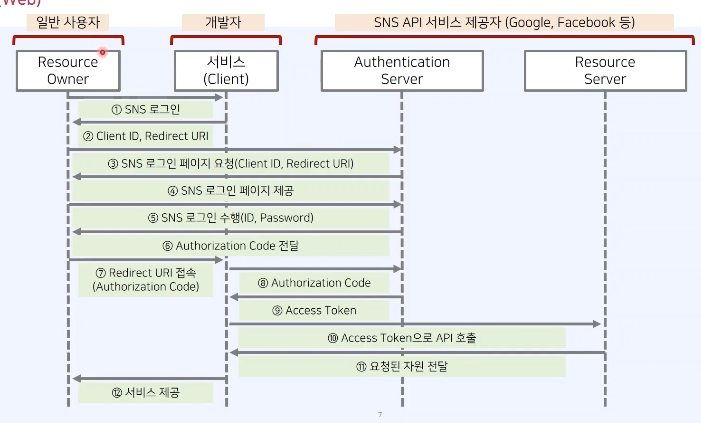

## 인증과 인가

- 인증(Authentication) : 사용자가 “누구인지”를 증명하는 과정이다.

  - ex) id, pw로 로그인

- 인가(Authorization): 인증된 사용자에게 “어떤 리소스에 접근할 수 있는가”를 결정하는 과정이다.
  - ex) 예: Access Token을 통해 특정 API 접근 허용

## OAuth란?

- OAuth는 제3자 애플리케이션(Client)이 리소스 서버(Google, Facebook 등)에 저장된 사용자 정보에 접근하도록 허용하는 표준 프로토콜이다.

- 핵심 포인트:

  - 사용자의 ID/PW를 제3자 애플리케이션에 절대 전달하지 않는다.

  - 대신 Authorization Code + Access Token을 활용한 안전한 권한 위임 방식이다.

  - “Google 로그인”처럼 보이는 기능은 OAuth의 대표적인 구현이다.

## 안전하지 않은 인증 방식 예시

- 안전하지 않은 SNS 로그인 방식을 생각해보자.
- 아래 경우에서는 사용자가 서버에게 Google 아이디와 패스워드를 알려주어야 한다.



## Access Token 이용하기

- 사용자가 설정한 권한에 대해서만 Google 정보에 접근할 수 있도록 하자.
- 바로 Access Token을 이용하는 것이다.



- 이러한 과정을 어떻게 효율적으로 구성할 수 있을지 고려해 보자.

## OAuth 2.0 구성 요소

- OAuth 2.0의 핵심 구성 요소는 다음과 같다.

| 구성요소                   | 설명                                                                        |
| -------------------------- | --------------------------------------------------------------------------- |
| Resource Owner             | 자신의 리소스를 제3자 서비스에게 접근 허용할지 결정하는 주체                |
| Client(제3자 앱/웹 서비스) | 사용자 데이터를 가져오려는 서비스(ex. 동욱님의 앱)                          |
| Resource Server            | 실제 사용자 정보가 저장된 서버 (Google API 서버)                            |
| Authorization Server       | 인증 처리 + Authorization Code & Token 발급 담당 서버 (Google OAuth Server) |

## OAuth 2.0 동작 예시 (개발자 = Client 입장에서)



## Authorization Code Grant Flow (웹/앱에서 가장 많이 사용)

### 1. Client → Authorization Server

사용자를 Authorization Server로 리다이렉트한다.
사용자는 로그인 상태가 아니라면 Google 로그인 화면이 뜬다.

### 2. Authorization Server → User

“이 앱이 당신의 어떤 정보에 접근하는 걸 허용하겠습니까?” 라는 동의 화면 제공
사용자가 승인하면 Authorization Code 발급

### 3. User → Client

Authorization Code를 Client Redirect URI로 전달

- Authorization Code는 브라우저 리다이렉트(302 Redirect) 로 Client의 Redirect URI에 쿼리 스트링(query parameter) 으로 붙여 전달된다.
  즉, Authorization Server가 사용자를 Client의 Redirect URI로 이동시키면서 URL에 code 값을 실어 보내는 방식이다.

<details>
<summary> Authorization Code를 Client Redirect URI로 전달 흐름 상세 설명
</summary>

1. Authorization Server가 리다이렉트 응답 반환

사용자가 “동의”를 완료하면 Authorization Server는 다음과 같은 HTTP 응답을 만든다.

```perl
HTTP/1.1 302 Found
Location: https://your-service.com/oauth/callback?code=AUTHORIZATION_CODE&state=xyz
```

- 302 Found: 브라우저를 다른 주소로 이동시키는 상태 코드

- Location 헤더: 이동할 URI

  - code: Authorization Code

  - state: CSRF 방어용 값(선택이 아니라 사실상 필수)

2. 브라우저가 Location으로 이동

브라우저는 자동으로 아래 URL로 이동한다:

```perl
https://your-service.com/oauth/callback?code=AUTHORIZATION_CODE&state=xyz
```

이 과정에서 Client는 code를 받게 된다.

3.  Client는 Redirect URI에서 code를 추출

웹 서버(Client)는 쿼리 스트링으로 전달된 code를 읽는다:

예: Node.js Express

```ts
app.get('/oauth/callback', async (req, res) => {
  const { code, state } = req.query;

  // 여기서 Authorization Code를 Authorization Server에게 보내 Access Token으로 교환
});
```

#### 정리: Authorization Code는 다음과 같은 형태로 전달된다

사용자 → Authorization Server → (302 Redirect) → Client Redirect URI
→ https://your-app.com/callback?code=XXXX&state=YYYY

즉, 브라우저 리다이렉트 + 쿼리 스트링 방식이 핵심이다.

</details>

### 4. Client → Authorization Server

Authorization Code + Client Secret을 보내 Access Token 교환 요청

### 5. Authorization Server → Client

Access Token (필요하다면 Refresh Token 포함) 발급

### 6. Client → Resource Server

Access Token 사용해 API 요청

### 7. Resource Server → Client

사용자 데이터 반환

## 💡 보완해야 할 핵심 개념 몇 가지

1.  Access Token은 짧게, Refresh Token은 길게

    - Access Token: 짧은 만료 시간(보통 10분~1시간)

    - Refresh Token: 길게(며칠~몇 주), 단 서버에 안전하게 저장 필요

2.  Authorization Server와 Resource Server는 분리될 수 있다

    - Google의 경우도 실제로 별도 서버다.

3.  Authorization Code Grant를 사용하는 이유

    - Client가 ID/PW를 직접 다루지 않는다

    - Access Token이 브라우저 URL로 노출되지 않는다

    - “Code → Token 교환 과정”에서 Client Secret을 사용해 보안 강화

4.  Implicit Flow는 이제 거의 사용되지 않는다

    - SPA에서 사용하던 방식이지만 보안 문제로 현재는 권장되지 않는다.

5.  PKCE(Proof Key for Code Exchange)

    - 모바일/SPA에서 Authorization Code를 더 안전하게 만드는 추가 보안 강화 기법, 지금은 거의 필수에 가까움
    - PKCE 설명: https://datatracker.ietf.org/doc/html/rfc7636

```

```
