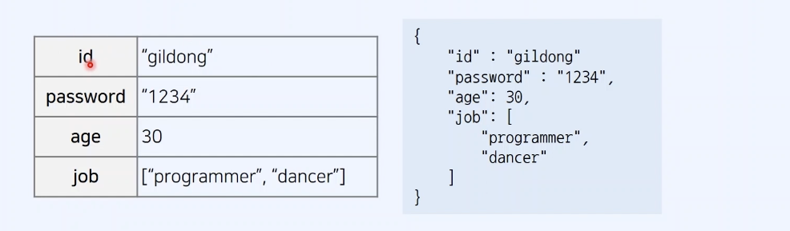
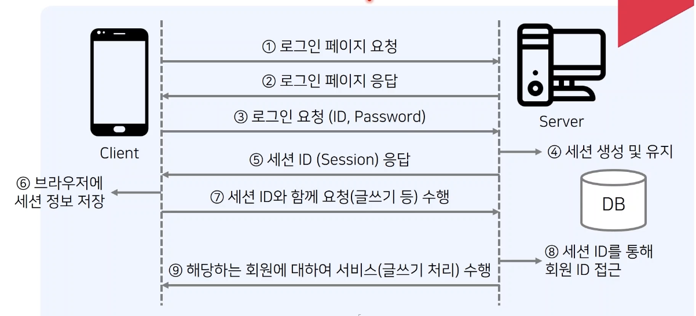
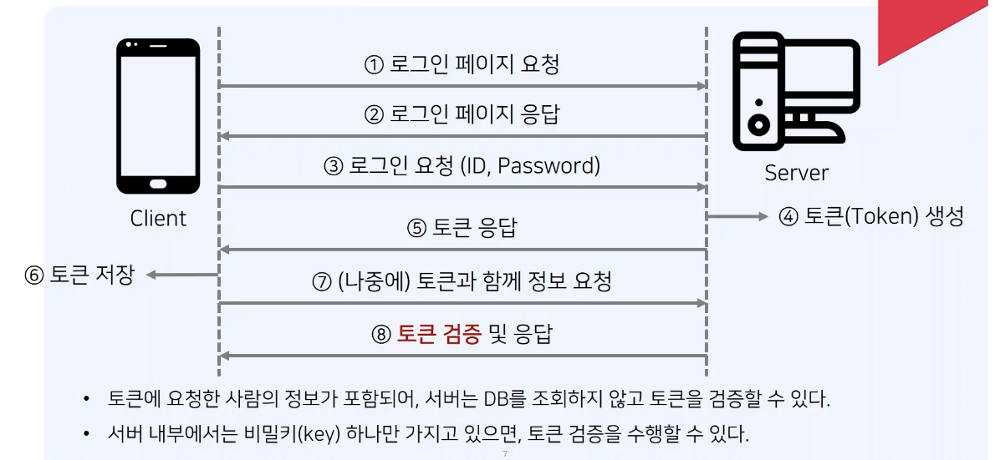
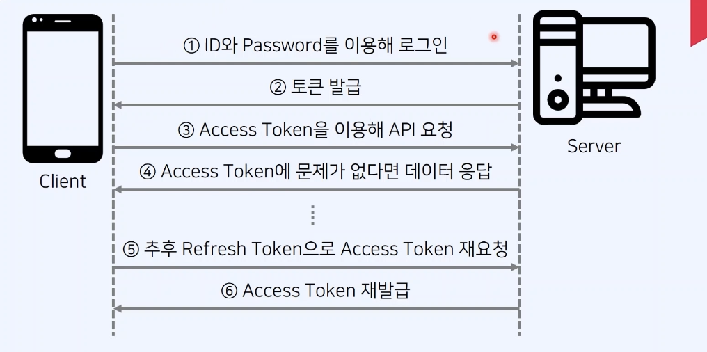

## JSON 형식(Format)

- JSON(JavaScript Object Notation)은 클라이언트–서버 간 데이터를 주고받기 위해 사용하는 경량의 데이터 형식(format) 중 하나
- `{ key: value }` 구조의 객체 형태로 정보를 표현하며, 직렬화/역직렬화가 쉽고 언어 독립적이다.

## 세션 개념

- **서버가 사용자별 상태(State)를 저장하는 방식**

- 사용자가 로그인하면 서버는 메모리 혹은 Redis 같은 저장소에 사용자 정보를 기록하고, 이를 식별하는 `sessionId`를 쿠키로 브라우저에 전달한다.

- 브라우저는 요청마다 자동으로 이 `sessionId`를 보냄으로써 인증을 유지한다.

## 세션 인증 방식

## 세션 방식의 특징

[장점]

- 민감 정보는 서버에만 존재

- 클라이언트가 가진 정보는 sessionId뿐이라 상대적으로 안전

[단점]

- 악의적인 공격자가 세션 ID를 탈취하여 사용자인 척 위장할 수 있다. -> 세션 ID를 탈취당하는 경우, 사용자의 많은 권한 및 개인 정보를 탈취당할 수 있다.
- 동시 접속자가 많아질수록 서버 메모리 부담 증가
- 세션 해킹(session hijacking) 발생 시 큰 피해 가능
- 수평 확장(Load Balancing) 시 Sticky Session 또는 세션 공유/동기화 필요

## Token 인증 방식(JWT 기반)

- JWT는 인증에 필요한 정보를 **암호화가 아닌 서명(Signature)** 으로 보호하는 JSON 기반 토큰.
- 서버는 DB 조회 없이 서명을 검증하는 것만으로 토큰의 진위 판별 가능.
- Header, Payload, Signature 구조로 이루어짐.
- 토큰에 요청한 사람의 정보가 포함되어, 서버는 DB를 조회하지 않고 토큰을 검증 가능
- 서버 내부에서는 비밀키(key)하나만 가지고 있으면 토큰 검증을 수행 가능

## JWT이란?

- JWT는 인증에 필요한 정보를 암호화한 JSON 형식의 토큰이다.
- JWT 토큰을 HTTP 헤더에 실어 서버가 클라이언트를 식별할 수 있도록 한다.
- JWT는 세 가지 구성요소(Header, Payload, Signature)를 가진다.
- 사용자가 인증을 수행하면, 서버는 다음의 정보를 가진 JWT 토큰을 발급한다.
  - Header: 사용할 해시 알고리즘 등의 메타 정보를 포함
  - Payload: 키(key)와 값(value) 형식으로 이루어진 정보(claim)의 구성 -> 이 값을 서버로 전달한다.
  - Signature: (헤더 + 페이로드 + 키(key)) 정보를 해싱하여 Client에게 함께 전달한다.

## JWT 예시

- Header: { "alg": "HS256", "typ": "JWT" }
- Payload: { "sub": "user", "id": "admin" }
- Signature: 위 두 내용에 대하여 적절한 서버 키 값을 더해 해싱한 값
- https://jwt.io/

## JWT를 이용한 인증

- 나중에 사용자(client)는 자신이 받았던 JWT 토큰을 다시 서버에 전달한다.
- 서버는 (헤더 + 페이로드 + 서버 내에 있는 키(kye))를 해싱한 값이 사용자로부터 전달받은 것과 일치하는지 체크한다.
- 이 과정에서 서버가 가지고 있는 비밀키(secret key)를 사용한다.

## JWT 인증 원리

- 사용자는 서버가 처음에 부여했던 권한만큼의 작업을 요청할 수 있다.
- 데이터를 변경하면 해시 값이 변경되므로, 악의적인 공격자가 Payload를 수정하는 것이 불가능하다.
- 예를 들어 사용자의 등급이 1,2,3,4,5일 때 5등급의 사람이 1등급으로 Payload를 변경해 보냈다고 해보자. 이 경우, 서버의 키를 모르므로, 서명 값이 일치하지 않아 서버가 위조 여부를 알 수 있다.

## JWT 방식의 특징

[장점]

- 세션 기반 인증 방식에 비해 서버가 DB에 세션 정보를 가지고 있을 필요가 없다.
- 각 해시 값이 어떤 Header와 Payload를 가지는지 일일이 서버 DB에서 저장할 이유가 없다. -> 서버에서 상태 정보를 저장하지 않아도 되므로, 무상태성(stateless)이 유지된다.
- 토크 기반이므로, 서버의 비밀키만 공유된다면 서로 다른 웹 서버에 대해서도 동작할 수 있다. (웹 브라우저의 쿠키와 다른 점)

[단점]

- 세션에 비하여 토큰 자체의 데이터 길이가 길다.
- 페이로드는 암호화되지 않으므로, 중요한 정보를 담기 적절하지 않을 수 있다.
- 토큰을 탈취당하는 경우 보안상의 문제가 발생할 수 있다.(때문에 토큰에 사용 기한을 부여)

## JWT 토큰의 유의사항

- Payload 자체는 중간자 공격에 의해 노출될 수 있으므로, 페이로드에는 가능한 민감 정보를 넣지 않는다.
- 기본적으로 JWT의 목적은 정보 보호보다는 다음의 목적과 같다.
  - 위조 방지
  - 서버의 메모리 가용 이점(DB 조회 필요 없음)

## 실제 인증 방식 사례 (JWT)

## JWT + HttpOnly 쿠키 조합으로 세션과 유사하게 상태 유지하는 패턴 (Stateful JWT)

### ⭐ 가장 많이 쓰는 조합 (현대적인 보안 패턴)

Access Token → 메모리 저장 (메모리 + React 상태 등)

Refresh Token → HttpOnly Secure SameSite 쿠키에 저장

#### 이유

- Access Token → 짧게(5~15분) 쓰니까 메모리 안전성 최적

- Refresh Token → 오래 유지해야 해서 쿠키가 적합

- 새로고침 시 Refresh Token으로 Access Token 재발급 가능
  → UX + 보안 밸런스 최고

#### 왜 세션과 비슷하다고 함?

“Refresh Token 관리 방식이 세션 저장소와 비슷해짐”

대부분의 실제 서비스는 다음처럼 구현한다:

- Access Token → HttpOnly 쿠키 or 클라이언트 메모리에서 관리

- Refresh Token → HttpOnly 쿠키 + 서버 DB(화이트리스트) 저장

Refresh Token을 DB에서 관리하는 순간 →
서버가 다시 상태(state)를 가지게 된다.

이게 세션과 비슷하다고 말하는 핵심 이유.

결국 서버가 사용자 인증 상태를 일부 추적하게 된다.
즉, 설계 패턴 자체가 "Stateless JWT"가 아닌 "Stateful JWT" 형태로 바뀐다.

### 액세스 토큰 저장 위치별 장단점 비교

| 저장 위치                         | 장점                                                                          | 단점 / 주의점                                                                                                          | 보안 관련                                                                              |
| --------------------------------- | ----------------------------------------------------------------------------- | ---------------------------------------------------------------------------------------------------------------------- | -------------------------------------------------------------------------------------- |
| **HttpOnly 쿠키**                 | - 브라우저가 자동으로 요청마다 전송 → 편리 - 새로고침 후에도 유지됨        | - CSRF 공격에 취약 - 서버에서 토큰 무효화, 로그아웃 처리 복잡 - 모든 요청에 자동 전송되므로 불필요한 트래픽 발생 | - HttpOnly + Secure + SameSite 옵션 필요 - CSRF 토큰과 함께 사용 권장               |
| **로컬 스토리지 / 세션 스토리지** | - CSRF 공격 영향을 받지 않음 - 브라우저에서 쉽게 접근 가능                 | - XSS 공격에 취약 (JS 코드로 쉽게 탈취 가능) - 새로고침 시 세션 스토리지는 초기화됨                                 | - XSS 방어가 필수 - 민감 정보는 포함하지 않는 것이 원칙                             |
| **클라이언트 메모리 (JS 변수)**   | - XSS 공격에도 접근 어렵고, 브라우저를 닫으면 사라짐 - CSRF 공격 영향 없음 | - 새로고침 시 토큰 소멸 → 페이지 이동 시 재발급 필요 - 장기 세션 유지 어려움                                        | - 안전하지만, 페이지 새로고침에 대한 처리 필요 - Refresh Token으로 재발급 구조 필요 |

## CSRF와 XSS 간단 개념 정리

### CSRF(Cross-Site Request Forgery)

사용자를 속여서, 사용자가 의도하지 않은 요청을 보내게 만드는 공격.

#### 어떻게 일어날까?

- 사용자가 A사이트에 로그인된 상태

- 공격자가 만든 악성 사이트에 접속

- 악성 사이트가 A사이트의 API로 요청을 몰래 보냄

- 브라우저는 자동으로 쿠키를 포함해서 전송

- 결과적으로 사용자가 “본인의 의지와 상관없이” 행동을 수행

#### 한 줄 요약

"쿠키 자동 전송"을 악용해 사용자가 모르게 요청을 보내는 공격

### XSS(Cross-Site Scripting)

사이트 안에 악성 스크립트를 주입하여 실행시키는 공격.

#### 어떤 식으로 일어날까?

- 사용자 입력을 필터링 없이 화면에 출력

- 공격자가 `` 같은 코드를 입력

- 다른 사용자의 브라우저에서 해당 스크립트가 실행됨

#### 악용되는 예

- 로컬 스토리지에 저장된 JWT 탈취

- 쿠키 읽기(document.cookie)

- DOM 조작

- 피싱 페이지로 redirect

#### 한 줄 요약

"사이트 안에 악성 JS를 삽입해 사용자 브라우저에서 실행시키는 공격"
