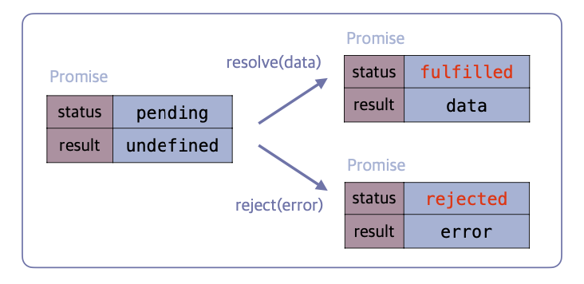

## Promise

### Promise

- 콜백 헬 문제를 해결하기위해 ES6에서 도입됨
- 비동기 작업의 **상태(state)와 결과(result)를 관리하는 객체**
- Promise는 다음 3가지 상태 중 하나를 가짐:
  - 작업 진행중: Pending
  - 작업 성공: Fulfilled
  - 작업 실패: Rejected
- 한 번 Fulfilled 또는 Rejected 상태가 되면 더는 상태가 변경되지 않음(immutable) → Promise는 단 한 번만 resolve/reject될 수 있음



### Promise 동작 원리

- Promise 객체를 생성할 때, 콜백 함수(Executor)가 인자로 전달됨.
- 콜백 함수는 2개의 인자를 가짐
  - 성공 시 호출 될 함수(<span style="color:skyBlue">resolve</span>)
  - 실패 시 호출할 함수(<span style="color:skyBlue">rejected</span>)
- 비동기 작업을 수행하는 코드는 이 콜백 함수 내부에 작성됨
- 비동기 작업이 성공적으로 끝나면 콜백 함수의 첫 번째 인자인 resolve(결과)를 호출하여 Promise 상태를 <span style="color:skyBlue">fulfilled</span>로 변경하고 결과 값을 전달함
- 비동기 작업 중 에러가 발생하면 두 번째 인자인 reject(에러)를 호출하여 Promise 상태를 <span style="color:skyBlue">rejected</span>로 변경하고 에러 객체를 전달함

```js
const delay = (ms) => {
  return new Promise((resolve, reject) => {
    if (ms < 0) {
      // rejected 상태로 변경
      reject(new Error('시간은 음수가 될 수 없습니다'));
    } else {
      setTimeout(() => {
        // resolved 상태로 변경
        resolve(`약속된 ${ms}ms가 지났습니다.`);
      }, ms);
    }
  });
};
```

- 여기서 `resolve`와 `reject`는 우리가 직접 만든 함수가 아니라
  자바스크립트 엔진이 Promise를 생성하면서 자동으로 제공하는 함수.

- 개발자는 어떤 상황에서 성공(resolve)이고 실패(reject)인지 판단하는 로직만 작성한다.

### Promise 내부는 동기, then은 비동기

Promise는 다음과 같은 중요한 특징이 있음:

- **콜백 함수 내부는 동기적으로 실행됨**

- 하지만 `then`, `catch`, `finally`의 콜백은 **항상 비동기(microtask queue)에서 실행됨**

```js
new Promise((resolve) => {
  console.log('A'); // 동기
  resolve();
}).then(() => {
  console.log('B'); // 비동기(microtask)
});

console.log('C');

// 출력: A → C → B
```

- 그래서 Promise.resolve처럼 “즉시 성공”을 만들어도
  then의 실행은 항상 동기 코드보다 나중이다.

```js
// 예시: 1초 후에 랜덤 숫자를 반환하는 getData 함수
function getData() {
  return new Promise((resolve, reject) => {
    setTimeout(() => {
      // 0~9 랜덤
      const value = Math.floor(Math.random() * 10);
      if (value < 8) {
        resolve(value); // 성공
      } else {
        reject('랜덤 에러 발생'); // 실패
      }
    }, 1000);
  });
}
```

### 즉시 반환: Promise.resolve / Promise.reject

비동기 작업을 기다리지 않고
바로 **성공한 Promise, 실패한 Promise**를 만들 수 있음.

```js
// 숫자 즉시 반환 예시
const p1 = Promise.resolve(42);
// 배열 즉시 반환 예시
const p2 = Promise.resolve([1, 2, 3]);
// 에러를 즉시 던지는 예시
const pError = Promise.reject(new Error('즉시 실패'));
```

> 주의: 값이 즉시 전달된다고 해서 “동기”가 아님
> **then/catch는 항상 microtask queue에서 비동기로 실행된다**

- 값을 바로 전달하고 해서 동기 처리 되는 것은 아니다. Promise.resolve와 Promise.reject 역시 항상 Promise 객체를 반환한다.

- p1, p2, pError가 단순한 값이나 에러가 아니라 Promise 인스턴스이고 전부 비동기로 처리가 된다.

```js
console.log('1');

Promise.resolve('비동기 작업 성공').then(console.log);

console.log('2');

// 출력
// 1
// 2
// '비동기 작업 성공'
```

- 값을 바로 전달하고 해서 동기 처리 되는 것은 아니다. Promise.resolve와 Promise.reject 역시 항상 Promise 객체를 반환한다.

### 언제 이런 즉시 반환을 사용할까?

#### 1. 함수의 반환 타입을 Promise로 통일하고 싶을 때

동기/비동기가 섞여 있으면 API 사용이 불편해진다.

❌ 문제 예시 (동기 + 비동기 섞임)

```js
function fetchUser(id) {
  if (id === 0) {
    return { name: 'Guest' }; // 동기 반환
  }

  return fetch(`/api/users/${id}`).then((res) => res.json()); // 비동기 반환
}

const user = fetchUser(0);
// 동기라서 user.name 접근 가능 → 일관성 없음
```

✅ 즉시 반환으로 일관성 유지

```js
const cache = {
  user: { name: 'Lee', age: 25 },
};

function fetchUser(id) {
  if (cache.user) {
    return Promise.resolve(cache.user); // 동기 값 → Promise 반환
  }

  return fetch(`/api/users/${id}`).then((res) => res.json());
}

// 항상 .then() / await 가능
fetchUser(0).then(console.log);
```

#### 2. 테스트나 예제 코드에서 성공/실패 상황을 쉽게 흉내 낼 때

성공/실패를 즉시 흉내 내기

```js
function mockApiSuccess(data) {
  return Promise.resolve({ status: 'ok', data });
}

function mockApiFailure(message) {
  return Promise.reject(new Error(message));
}

// 테스트 예시
mockApiSuccess({ id: 1 }).then(console.log);

mockApiFailure('테스트 에러 발생').catch((err) => console.log(err.message));
```

#### 3. 코드 흐름을 Promise 기반으로 유지하고 싶을 때

동기 작업이어도 promise 체이닝에 끼워 넣기 쉽다.

예시: 조건에 따라 동기/비동기 로직 섞인 경우

```js
function getConfig(mode) {
  if (mode === 'local') {
    return Promise.resolve({ env: 'local', debug: true }); // 동기 로직을 Promise.resolve로 Promise 처리
  }

  return fetch('/config.json').then((res) => res.json());
}

getConfig('local').then((config) => {
  console.log('환경 설정:', config);
});
```

### Promise 사용 시 장점 (콜백 헬 해결)

- 콜백이 중첩되지 않고 체이닝(then → then → then) 형식으로 작성 가능
  → 코드가 “수평적”으로 펼쳐져 가독성 향상

- 에러를 catch 한 번으로 처리할 수 있어 유지보수 용이

- async/await의 기반 구조로 확장성 좋음

- 비동기 흐름을 구조적으로 관리 가능
