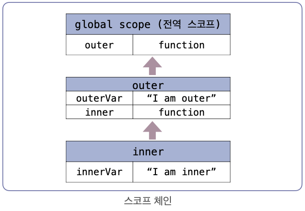

## 스코프 체인

- 변수를 찾을 때 상위 스코프를 따라가는 구조
- 현재 스코프에서 변수를 찾지 못하면 <u>부모 스코프를 차례로 탐색하며, 최종적으로 전역 스코프까지 올라감</u>
- 스코프 체인은 렉시컬 스코프(정적 스코프)방식을 따르므로, 함수가 호출된 위치가 아니라 **선언된 위치를 기준**으로 상위 스코프가 결정됨

## 예제 코드

```js
function outer() {
  let outerVar = 'I am outer';

  function inner() {
    let innerVar = 'I am inner';
    console.log(outerVar); // 스코프 체인을 따라 outerVar 접근 가능
  }

  inner();
  console.log(innerVar); // 에러 (inner 내부에서만 접근 가능)
}
outer();
```

- 스코프 생성 과정
  1. global scope
  2. outer scope
  3. inner scope

[스코프 체인 과정]

- inner -> outer -> 전역 스코프 -> (없으면 ReferenceError)



- 화살표는 상위 스코프를 가르킴
- inner 함수가 outer 함수 내부에서 선언되었기 때문에 inner 함수의 상위 스코프는 outer 함수

## 정리

- 변수를 찾을때 현재 스코프에서 변수를 찾지 못하면 부모 스코프를 차례로 탐색하며 최종적으로 전역 스코프까지 올라가게 됨
- 상위 스코프를 결정할 때 함수가 호출된 아니라 선언된 위치를 기준으로 결정한다. -> 이 원칙 덕분에 스코프 체인은 언제나 예측 가능하게 동작함
  - inner 함수가 어디서 호출되든간에 inner 함수는 outer 함수 내부에서 선언되어었기 때문에 inner 함수의 상위 스코프는 outer 함수 스코프이다.
