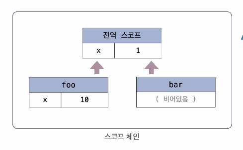

## 렉시컬 스코프(정적 스코프)

- 함수가 선언된 위치에 따라 상위 스코프가 결정되는 방식
- 함수가 실행될 때가 아니라, 함수가 정의된 시점에서의 스코프를 기준으로 상위 스코프를 탐색함

## 예제

아래 소스를 실행하면 1이 출력될까, 10이 출력될까?

```js
var x = 1;

function foo() {
  var x = 10;
  bar(); // bar 함수 호출
}

function bar() {
  console.log(x); // bar의 상위 스코프에서 x 찾기: 1
}
foo();
```

bar의 상위 스코프는 foo일까? 아니다.

bar는 전역에서 정의되었기 때문에 bar의 상위 스코프는 전역 스코프이다.

따라서 bar 내부에서 어떤 변수를 참조하고 있을 때 bar 스코프에서 그 변수를 찾지 못하면 전역 스코프에서 검색한다.

따라서 1이 출력된다.


