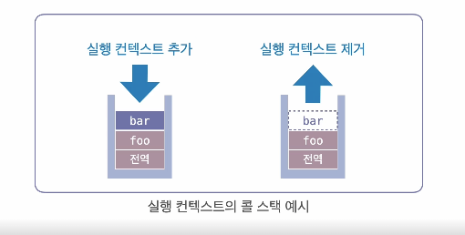

## 실행 컨텍스트

### 소스코드 평가와 실행 과정

- JavaScript 엔진은 코드를 실행하기 전에 소스코드 <span style='color:skyBlue'>평가 단계</span>를 거친 후 <span style='color:skyBlue'>실행 단계</span>에서 코드를 수행함
- <span style='color:skyBlue'>평가 단계</span>에서 <span style='color:skyBlue'>변수, 함수의 선언문만 먼저 실행</span>하여 실행 컨텍스트가 생성되고, 변수와 함수 선언이 메모리에 등록됨
  (평가 단계에서는 아직 값이 할당되지 않아 변수, 함수가 undefined 상태를 가짐)

### 실행 컨텍스트

- 변수, 함수, 스코프, this 바인딩 등의 정보를 담고 있음
- 코드가 실행되는 동안 **콜 스택**에 쌓이며, 새로운 함수를 만나면 기존 실행을 잠시 중단 후 그 함수 내부로 진입
- 이후 진입한 함수의 평가 및 실행 과정을 거치게

- 그 과정에서 새로운 실행 컨텍스트가 생성되고, 함수 실행이 끝나면 해당 컨텍스트가 제거됨
- 전역 실행 컨텍스트, 함수 실행 컨텍스트가 존재

### 콜스택

- JavaScript 엔진이 함수 실행 순서를 관리하는 스택 자료구조
- 실행 컨텍스트의 콜 스택에 의해 코드의 실행 순서가 결정된다
- 가장 마지막에 추가된 실행 컨텍스트가 먼저 제거됨
- 함수가 호출되면 실행 컨텍스트가 생성되어 스택에 쌓이고, 함수 실행이 끝나면 제거됨

### 실행 컨텍스트 종류

- #### 전역 실행 컨텍스트

  - 코드 실행이 시작되면 자동으로 생성
  - 전역 객체(window 또는 globalThis)와 전역 스코프를 포함
  - 전역 실행 컨텍스트는 프로그램 종료 시점까지 유지

- #### 함수 실행 컨텍스트

  - 함수가 호출될 때마다 새로운 실행 컨텍스트가 생성
  - 함수 내부에서 사용되는 변수와 스코프를 관리

### 예제 코드

```js
var x = 1;

function foo() {
  var y = 2;
  function bar() {
    console.log(x + y);
  }
  bar();
}

foo();
```

#### 실행 컨텍스트 생성 과정

1. 전역 소스의 평가
   - 변수 x와 함수 foo()가 전역 실행 컨텍스트에 등록됨
2. 전역 소스의 실행
   - 변수 x에 1이 할당
   - foo() 호출 -> 새로운 함수를 만나면 그 함수 내부로 진입
3. foo() 함수의 평가
   - 변수 y와 함수 bar()가 함수 실행 컨텍스트에 등록됨
4. foo() 함수의 실행
   - 변수 y에 2가 할당
   - 함수 bar() 호출 -> 새로운 함수를 만나면 그 함수 내부로 진입
5. bar() 함수의 평가 및 실행
   - console.log(x+y)를 실행
6. bar() 함수가 종료되면 콜 스택에서 bar() 함수 실행 컨텍스트를 제거
7. foo() 함수가 종료되면 콜 스택에서 foo() 함수 실행 컨텍스트를 제거
8. 전역 소스가 종료되면 콜 스택에서 전역 실행 컨텍스트를 제거
9. 코드 종료



## 정리

1. 소스가 실행될 때 평가단계와 실행단계로 나누어진다.

   - 평가단계에서 실행 컨텍스트가 만들어지게 됨

2. 실행 컨텍스트는 콜스택에 쌓이게 되고 콜스택에 의해 프로그램 실행 순서가 결정된다.
