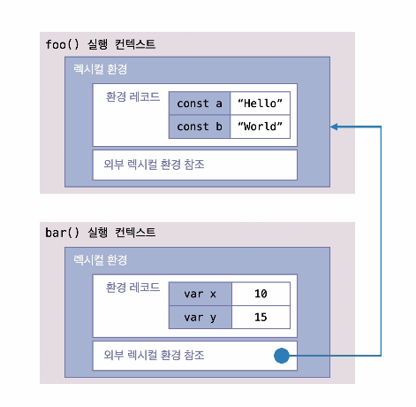

## 렉시컬 환경

### 렉시컬 환경

- 변수 및 함수 선언 정보를 저장하고, **스코프 체인을 관리**하는 자료구조
- 실행 컨텍스트가 생성될 때(소스코드 평가 시점) 함께 생성되며, 변수의 접근 범위(스코프)를 결정하는 역할을 함
- 환경 레코드와 외부 렉시컬 환경 참조를 포함하며, 이를 통해 상위 스코프의 변수에 접근 가능

> 스코프 - "변수와 함수가 어디까지 접근 가능한가"를 규정하는 개념적인 용어

> 렉시컬 환경 - 스코프를 실제 자바스크립트 엔진이 실제로 관리하기 위해 사용하는 내부 자료구조

> 즉, 스코프는 규칙이고 렉시컬 환경은 규칙을 구현한 실체

### 렉시컬 환경의 구성 요소

1.  환경 레코드

    - 현재 실행 컨텍스트에서 선언된 변수, 함수, let, const, var 등을 저장하는 공간
    - 실행 시점에서 변수 값을 업데이트함
      - 변수 값 업데이트는 소스 코드의 실행시점에 일어남
      - 변수 등록은 소스 코드의 평가시점에 일어남

2.  외부 렉시컬 환경 참조
    - 현재 실행 컨텍스트에서 외부 스코프(부모 실행 컨텍스트)의 렉시컬 환경을 참조
    - 이를 통해 상위 스코프의 변수를 검색할 수 있도록 스코프 체인을 형성

## 정리

- 렉시컬 환경은 자바스크립트 엔진이 스코프를 구현하기 위한 내부 자료구조

- 렉시컬 환경은 환경 레코드와 외부 렉시컬 환경 참조로 구성됨

  - 환경 레코드에서는 변수 및 함수 선언 정보를 저장하고 실행 시점에서 변수 값을 업데이트함
  - 외부 렉시컬 환경 참조는 외부 스코프(부모 실행컨텍스트)의 렉시컬 환경을 참조 -> 이를 통해 스코프 체인이 가능하게 함

- 변수 등록과정은 소스 코드의 평가 시점에 일어남
  - 변수 등록되는 과정에 변수에는 값이 비어있는가?
    - var는 undefined로 초기화, let과 const는 선언만 되고 초기화되지 않은 상태로 잠시 접근할 수 없는 상태의 TDZ 구간에 머무르게 됨
