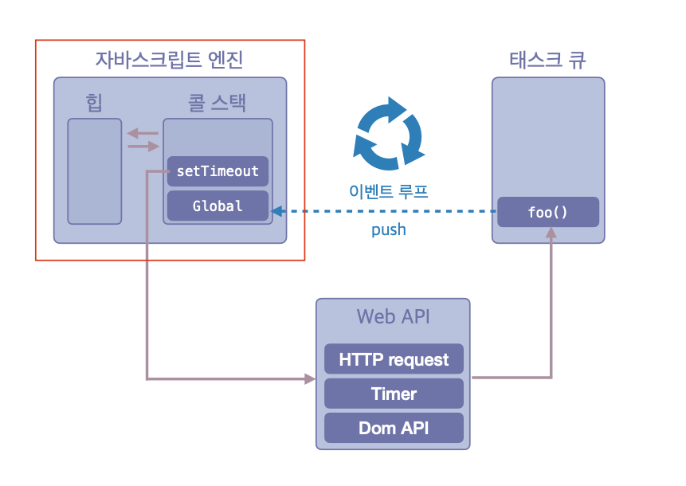

## 싱글 스레드의 한계를 극복하는 방법

### 이벤트 루프를 통해 싱글 스레드의 한계를 극복

- 자바스크립트는 싱글 스레드 방식으로 한 번에 하나의 작업만 처리할 수 있음
- 그러나 브라우저의 Web APIs와 이벤트 루프를 통해 마치 멀티 스레드처럼 비동기적으로 처리 가능함

### 콜 스택

- 실행 컨텍스트가 추가되고 제거되는 스택 자료구조
- 함수가 호출되면 함수 실행 컨텍스트가 순차적으로 콜 스택에 푸시되어 순차적으로 실행됨
- 가장 최근에 추가된 함수가 가장 먼저 실행 완료(LIFO 구조)되어 스택에서 제거됨

### 힙

- 객체가 저장되는 메모리 공간
- 콜 스택의 실행 컨텍스트는 힙에 저장된 객체를 참조함
- 원시 타입 데이터는 콜 스택 내에 바로 저장되고, 객체 타입(객체, 함수, 배열 등)은 힙에 별도로 저장된 후 참조만 콜 스택에서 관리함

### Web APIs

- 브라우저가 제공하는 기능(자바스크립트 엔진 외부에 위치함)
- 자바스크립트가 싱글 스레드의 한계를 극복하도록 <span style="color:skyblue">비동기 작업(타이머, HTTP 요청, DOM 이벤트 등)을 대신 처리</span>해 줌
- 작업 완료 후 그 결과로 실행될 콜백 함수를 <span style="color:skyblue">태스크 큐에 추가</span>하여 이벤트 루프가 처리하도록 전달함

### 태스크 큐

- 비동기 함수의 콜백 함수 또는 이벤트 핸들러가 실행되기 전에 일시적으로 <span style="color:skyblue">대기하는 공간</span>
- JavaScript 엔진의 콜 스택이 비어 있을 때 태스크 큐에 있는 작업들이 콜 스택으로 이동하여 실행됨

### 이벤트 루프

- 콜 스택과 태스크 큐를 계속해서 모니터링하여 작업을 관리하는 루프
- 콜 스택이 비어있을 때 태스크 큐에 대기 중인 함수가 있으면, 이벤트 루프는 순차적으로 <span style="color:skyblue">태스크 큐에서 콜백 함수를 콜 스택으로 이동</span>시켜 실행함
- 이를 통해 자바스크립트가 싱글 스레드임에도 마치 여러 작업이 동시에 처리되는 것처럼 보이게 함



## 비동기 동작 과정

```js
console.log('A');

setTimeout(() => {
  console.log('B');
}, 1000); // 비동기 작업(1초 후 실행)

console.log('C');

// 출력 결과: A → C → (1초 후) B
```

1. 콜 스택: console.log("A") 실행 -> "A" 출력 후 제거
2. setTimeout 호출 -> Web APIs에서 타이머 시작, 콜 스택에서 제거
3. 콜 스택: console.log("C") 실행 -> "C" 출력 후 제거
4. (1초 후) Web APIs가 타이머 완료 -> 콜백 함수(console.log("B"))를 태스크 큐에 추가
5. 이벤트 루프가 콜 스택이 빈 것을 확인 -> 태스크 큐에서 콜백 함수를 가져와 콜 스택에 넣음, 콜 스택: console.log("B")를 실행 -> "B" 출력 후 제거

### 주의할 점

- 브라우저는 <span style="color:lightCoral">멀티 스레드 방식<span>으로 동작함
- JavaScript 엔진(콜스택과 힙을 관리)은 <span style="color:skyblue">싱글 스레드</span>로 동작하지만, 이는 JavaScript 엔진만의 특성임
- 비동기 작업(타이머, HTTP 요청, DOM 이벤트 등)은 브라우저의 Web APIs가 별도의 <span style="color:lightCoral">멀티 스레드 환경</span>에서 처리함
- 따라서 JavaScript 코드 자체는 <span style="color:skyblue">싱글 스레드</span>로 동작하지만, 브라우저 환경 전체는 <span style="color:lightCoral">멀티 스레드</span>로 동작하기 때문에 비동기 처리가 가능함

## 정리

- JavaScript 엔진: <span style="color:skyblue">싱글 스레드</span>
- 브라우저(Web APIs, 이벤트 루프, 렌더링 등): <span style="color:lightCoral">멀티 스레드</span>
- 이러한 구조 덕분에 JavaScript가 싱글 스레드임에도 불구하고 비동기 처리가 가능함
