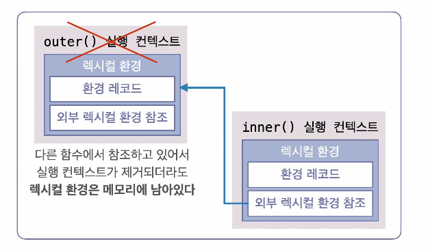

## 클로저란

- ### 클로저

  - 함수 내부에서 선언된 함수가 외부 함수의 변수를 기억하고 참조할 수 있는 현상
  - 외부 함수가 실행을 마치고 스코프에서 사라진 후에도, 내부 함수는 여전히 외부 함수의 변수에 접근 가능
  - 렉시컬 스코프와 실행 컨텍스트 덕분에 동작

```js
function outer() {
  let count = 0; // 외부 함수의 변수

  function inner() {
    count++;
    console.log(count); // 내부 함수에서 외부 변수 접근
  }
  return inner;
}

// outer 실행 후 counter에 inner 함수 저장
const counter = outer(); // 여기서 outer 함수 종료 및 실행 컨텍스트 제거

// outer 함수가 종료되어도 outer의 변수에 접근 가능
counter(); // 1
counter(); // 2
counter(); // 3
```


